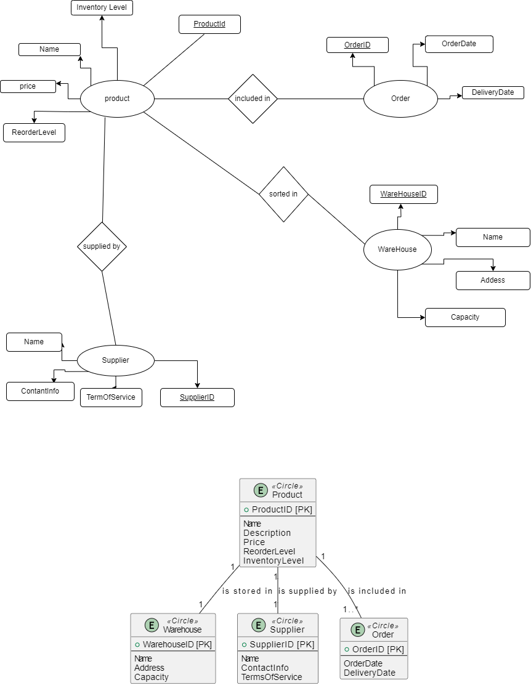

# Inventory Management System

## ER Diagram

This ER diagram illustrates the entities and their relationships in the Inventory Management System:

This diagram shows the relationships between the entities:

- **Warehouse**: Stores products.
- **Product**: Can be included in orders, is supplied by suppliers, and is stored in warehouses.
- **Supplier**: Supplies products.
- **Order**: Includes products.

Product is related to Warehouse in a many-to-one relationship, as many products can be stored in one warehouse.

Product is related to Supplier in a many-to-one relationship, as many products can be supplied by one supplier.

Product is related to Order in a many-to-many relationship, as a product can be included in many orders, and an order can contain many products.

## Product table:

| HTTP Request         | Operation | Description                            | HTTP Status Codes | Request Sample | Response Sample |
|----------------------|-----------|----------------------------------------|-------------------|----------------|-----------------|
| GET /products        | Read      | Get a list of all products             | 200 OK            | N/A            | [{"ProductID":1,"Name":"sultana","Description":"nice","Price":10,"ReorderLevel":5,"InventoryLevel":20}] |
| GET /products/{id}   | Read      | Get details of a specific product      | 200 OK, 404 Not Found | N/A          | {"ProductID":1,"Name":"sultana","Description":"nice","Price":10,"ReorderLevel":5,"InventoryLevel":20} |
| POST /products       | Create    | Create a new product                   | 201 Created, 400 Bad Request | {"Name":"tango","Description":"nice","Price":15,"ReorderLevel":3,"InventoryLevel":30} | {"ProductID":2,"Name":"tango","Description":"nice","Price":15,"ReorderLevel":3,"InventoryLevel":30} |
| PUT /products/{id}   | Update    | Update details of a specific product   | 200 OK, 400 Bad Request, 404 Not Found | {"Name":"UpdatedProduct1","Description":"UpdatedDescription1","Price":12,"ReorderLevel":4,"InventoryLevel":25} | {"ProductID":1,"Name":"UpdatedProduct1","Description":"UpdatedDescription1","Price":12,"ReorderLevel":4,"InventoryLevel":25} |
| PATCH /products/{id} | Update    | Update partial details of a specific product | 200 OK, 400 Bad Request, 404 Not Found | {"Name":"PartialUpdate","Price":14} | {"ProductID":1,"Name":"PartialUpdate","Description":"UpdatedDescription1","Price":14,"ReorderLevel":4,"InventoryLevel":25} |
| DELETE /products/{id}| Delete    | Delete a specific product              | 204 No Content, 404 Not Found | N/A          | N/A             |

 

## Warehouses table:

| HTTP Request         | Operation | Description                            | HTTP Status Codes | Request Sample | Response Sample |
|----------------------|-----------|----------------------------------------|-------------------|----------------|-----------------|
| GET /warehouses      | Read      | Get a list of all warehouses           | 200 OK            | N/A            | [{"WarehouseID":1,"Name":"Warehouse1","Address":"17street","Capacity":1000}] |
| GET /warehouses/{id} | Read      | Get details of a specific warehouse    | 200 OK, 404 Not Found | N/A            | {"WarehouseID":1,"Name":"Warehouse1","Address":"Address1","Capacity":1000} |
| POST /warehouses     | Create    | Create a new warehouse                 | 201 Created, 400 Bad Request | {"Name":"Warehouse2","Address":"Address2","Capacity":1500} | {"WarehouseID":2,"Name":"Warehouse2","Address":"ein areek","Capacity":1500} |
| PUT /warehouses/{id} | Update    | Update details of a specific warehouse | 200 OK, 400 Bad Request, 404 Not Found | {"Name":"UpdatedWarehouseName","Address":"UpdatedAddress","Capacity":1200} | {"WarehouseID":1,"Name":"UpdatedWarehouseName","Address":"UpdatedAddress","Capacity":1200} |
| PATCH /warehouses/{id} | Update  | Update partial details of a specific warehouse | 200 OK, 400 Bad Request, 404 Not Found | {"Name":"PartialUpdate","Address":"UpdatedAddress"} | {"WarehouseID":1,"Name":"PartialUpdate","Address":"UpdatedAddress","Capacity":1200} |
| DELETE /warehouses/{id} | Delete | Delete a specific warehouse            | 204 No Content, 404 Not Found | N/A          | N/A             |

 

## Suppliers table:

| HTTP Request         | Operation | Description                            | HTTP Status Codes | Request Sample | Response Sample |
|----------------------|-----------|----------------------------------------|-------------------|----------------|-----------------|
| GET /suppliers       | Read      | Get a list of all suppliers            | 200 OK            | N/A            | [{"SupplierID":1,"Name":"manasracompany","Address":"hebron","Contact":"5599887455"}] |
| GET /suppliers/{id}  | Read      | Get details of a specific supplier     | 200 OK, 404 Not Found | N/A          | {"SupplierID":1,"Name":"Supplier1","Address":"Address1","Contact":"Contact1"} |
| POST /suppliers      | Create    | Create a new supplier                  | 201 Created, 400 Bad Request | {"Name":"makkacarpet","Address":"ramallah","Contact":"Contact2"} | {"SupplierID":2,"Name":"makkacarpet","Address":"rammallah","Contact":"598456521"} |
| PUT /suppliers/{id}  | Update    | Update details of a specific supplier  | 200 OK, 400 Bad Request, 404 Not Found | {"Name":"UpdatedSupplierName","Address":"UpdatedAddress","Contact":"UpdatedContact"} | {"SupplierID":1,"Name":"UpdatedSupplierName","Address":"UpdatedAddress","Contact":"UpdatedContact"} |
| PATCH /suppliers/{id}| Update    | Update partial details of a specific supplier | 200 OK, 400 Bad Request, 404 Not Found | {"Name":"PartialUpdate","Address":"UpdatedAddress"} | {"SupplierID":1,"Name":"PartialUpdate","Address":"UpdatedAddress","Contact":"Contact1"} |
| DELETE /suppliers/{id} | Delete  | Delete a specific supplier             | 204 No Content, 404 Not Found | N/A          | N/A             |

 

## Orders table :

| HTTP Request        | Operation | Description                             | HTTP Status Codes | Request Sample | Response Sample |
|---------------------|-----------|-----------------------------------------|-------------------|----------------|-----------------|
| GET /orders         | Read      | Get a list of all orders                | 200 OK            | N/A            | [{"OrderID":1,"Date":"2022-01-01","Total":100.00,"Status":"Pending"}] |
| GET /orders/{id}    | Read      | Get details of a specific order         | 200 OK, 404 Not Found | N/A          | {"OrderID":1,"Date":"2022-01-01","Total":100.00,"Status":"Pending"} |
| POST /orders        | Create    | Create a new order                      | 201 Created, 400 Bad Request | {"Date":"2022-01-02","Total":150.00,"Status":"Pending"} | {"OrderID":2,"Date":"2022-01-02","Total":150.00,"Status":"Pending"} |
| PUT /orders/{id}    | Update    | Update details of a specific order      | 200 OK, 400 Bad Request, 404 Not Found | {"Date":"2022-01-01","Total":120.00,"Status":"Shipped"} | {"OrderID":1,"Date":"2022-01-01","Total":120.00,"Status":"Shipped"} |
| PATCH /orders/{id}  | Update    | Update partial details of a specific order | 200 OK, 400 Bad Request, 404 Not Found | {"Status":"Cancelled"} | {"OrderID":1,"Date":"2022-01-01","Total":120.00,"Status":"Cancelled"} |
| DELETE /orders/{id} | Delete    | Delete a specific order                 | 204 No Content, 404 Not Found | N/A          | N/A             |

 <ht>

## This is the link of api in version 3.1.0 :
https://app.swaggerhub.com/apis/BADERD2001/Inventory_Management_System/3.1.0

